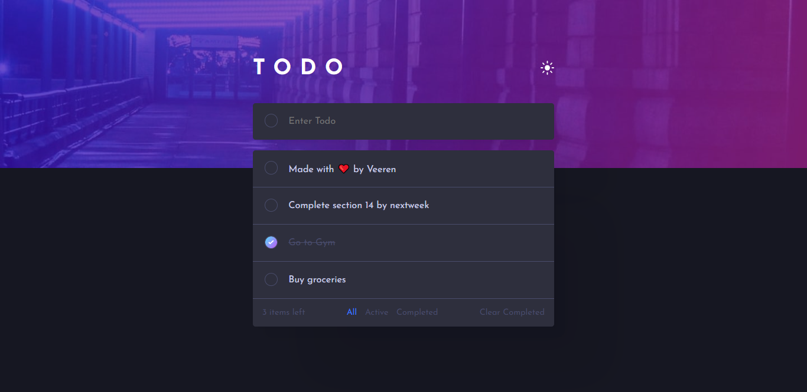

# Frontend Mentor - Todo app solution

This is a solution to the [Todo app challenge on Frontend Mentor](https://www.frontendmentor.io/challenges/todo-app-Su1_KokOW). Frontend Mentor challenges help you improve your coding skills by building realistic projects.

## Table of contents

- [Frontend Mentor - Todo app solution](#frontend-mentor---todo-app-solution)
  - [Table of contents](#table-of-contents)
  - [Overview](#overview)
    - [The challenge](#the-challenge)
    - [Screenshot](#screenshot)
    - [Links](#links)
  - [My process](#my-process)
    - [Built with](#built-with)
    - [What I learned](#what-i-learned)
    - [Continued development](#continued-development)
    - [Useful resources](#useful-resources)
  - [Author](#author)

## Overview

### The challenge

Users should be able to:

- View the optimal layout for the app depending on their device's screen size
- See hover states for all interactive elements on the page
- Add new todos to the list
- Mark todos as complete
- Delete todos from the list
- Filter by all/active/complete todos
- Clear all completed todos
- Toggle light and dark mode

### Screenshot



### Links

- [Solution URL](https://github.com/veerendranath0312/todo-app)
- [Live Site URL](https://todoapp-fem.netlify.app/)

## My process

### Built with

- Semantic HTML5 markup
- CSS
- Flexbox
- Vanilla JS

### What I learned

Creating custom Checkbox

```html
<input type="checkbox" class="list-item-checkbox" id="1" />
```

```css
.list-item-checkbox {
  --webkit-appearance: none;
  appearance: none;
  background: transparent;
  width: 25px;
  height: 25px;
  border: 2px solid var(--secondary-color);
  border-radius: 50%;
  margin-right: 20px;
  cursor: pointer;
  transform: translateY(-1px);
}

.list-item-checkbox:hover {
  border-color: var(--bright-blue);
}

.list-item-checkbox:checked {
  background-image: url('./images/icon-check.svg'), var(--check-background);
  background-repeat: no-repeat;
  background-position: center;
}
```

Using HTML `<template>` tag. HTML `<template>` tag holds some content that will be hidden when the page loads. Use JavaScript to display it

```html
<template>
  <div class="list-item">
    <input type="checkbox" class="list-item-checkbox" id="1" />
    <p class="list-item-text">Complete online JavaScript course</p>
    
  </div>
</template>
```

```js
const template = document.querySelector('template')
const listItem = template.content.cloneNode(true).children[0]
const checkbox = listItem.querySelector('.list-item-checkbox')
const text = listItem.querySelector('.list-item-text')
const crossMark = listItem.querySelector('.cross-mark')

checkbox.id = todo.id
checkbox.checked = todo.isCompleted
text.textContent = todo.todoText
crossMark.id = todo.id

todoList.append(listItem)
```

### Continued development

In future at some point of time, I want to update this project where we will store the todos in the browsers local storage.

### Useful resources

- [How to use template tag](https://www.youtube.com/watch?v=TlP5WIxVirU)

## Author

- Veerendranath
- Frontend Mentor - [@veerendranath0312](https://www.frontendmentor.io/profile/veerendranath0312)
